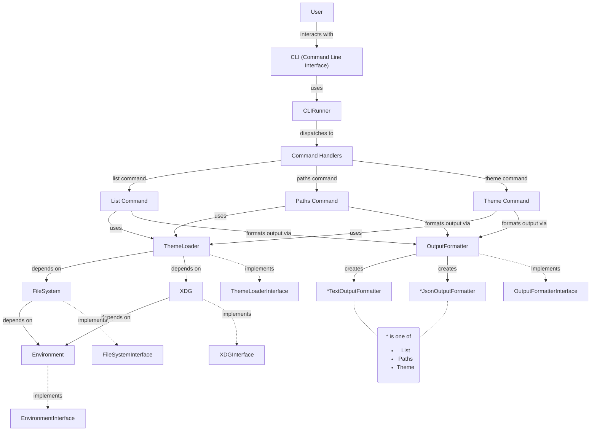
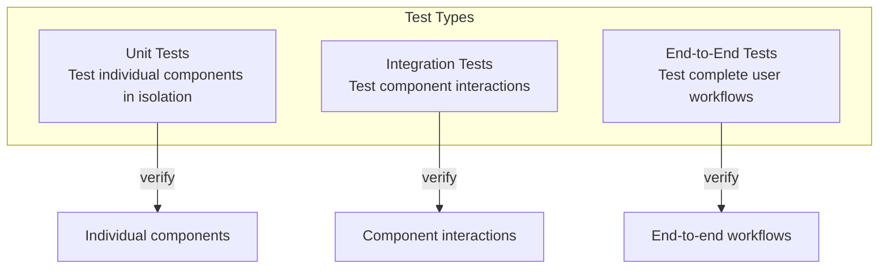
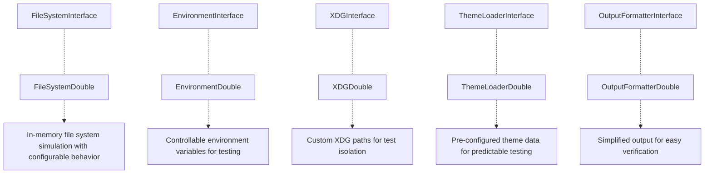
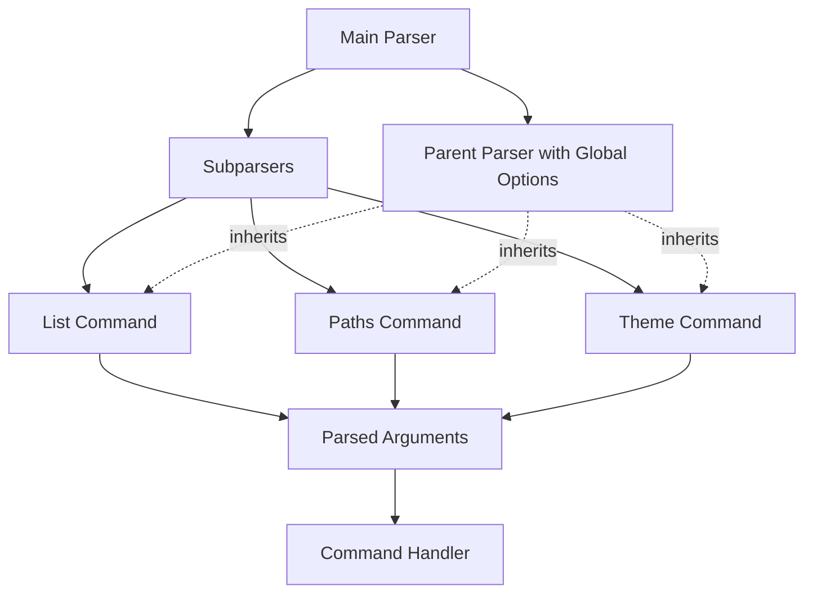
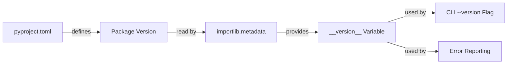

# Architecture

This document describes the high-level architecture of the `kde-colors` project.

## Package Structure

The `kde_colors` package is organized into the following structure:

```text
kde_colors/
├── __init__.py        # Main package initialization
├── __main__.py        # Entry point for direct execution, defined in pyproject.toml, calls cli_runner.run_cli()
├── cli/               # Command-line interface components
│   ├── __init__.py
│   ├── cli_arg_parser.py  # Argument parsing
│   └── cli_runner.py      # Command execution
├── interfaces/        # Protocol definitions
│   ├── __init__.py
│   ├── environment.py     # Environment interface
│   ├── file_system.py     # FileSystem interface
│   ├── output_formatter.py # OutputFormatter interface
│   ├── theme_loader.py    # ThemeLoader interface
│   └── xdg.py            # XDG interface
├── services/          # Service implementations
│   ├── __init__.py
│   ├── environment.py     # Environment service
│   ├── file_system.py     # FileSystem implementation
│   ├── output_formatter.py # OutputFormatter implementation
│   ├── theme_loader.py    # ThemeLoader implementation
│   └── xdg.py             # XDG implementation
└── tests/             # Test suite
    ├── __init__.py
    ├── unit/               # Unit tests
    │   └── __init__.py
    ├── integration/        # Integration tests
    │   └── __init__.py
    ├── e2e/                # End-to-end tests
    │   └── __init__.py
    ├── performance/        # Performance tests
    │   └── __init__.py
    └── support/           # Test doubles for interfaces
        ├── __init__.py
        ├── environment_double.py
        ├── file_system_double.py
        ├── output_formatter_double.py
        ├── theme_loader_double.py
        └── xdg_double.py
```

## Project Script

The `kde-colors` script is the entry point for the application. It is defined in the `kde_colors.__main__` module.

pyproject.toml defines the script entry point:
scripts = {'kde_colors' = "kde_colors.__main__:main"}

## System Overview

The following diagram shows the main components of the system and their relationships:



This architecture follows a clean, dependency-injected design with clear separation of interfaces and implementations. The CLI layer handles user interaction, the service layer provides core functionality, and interfaces establish contracts between components.

## Interface Design

The system uses protocol-based interfaces to define clear contracts between components. The main interfaces are defined in the `kde_colors.interfaces` package:

### FileSystemInterface

- __Purpose__: Abstract file system operations for both reading and writing.
- __Location__: `kde_colors.interfaces.file_system`
- __Key Methods__: `read_text()`, `exists()`, `is_file()`, `is_dir()`, `glob()`, `walk()`, `resolve_path()`, `expand_path()`, `list_files()`, `list_dir()`, `write_text()`

#### tests/support/file_system_double.py

- __Implements__: Implements the `FileSystemInterface` protocol
- __Purpose__: Test double implementation of the FileSystem interface for testing.
- __Location__: `tests.support.file_system_double`
- __Key Methods__: All methods from `FileSystemInterface` plus additional testing functionality like `mkdir()`, `remove()`, `rmdir()`

### XDGInterface

- __Purpose__: Abstract XDG Base Directory Specification that encapsulates XDG directory paths. Allows tests to inject custom XDG directories.
- __Location__: `kde_colors.interfaces.xdg`
- __Key Methods__: `xdg_cache_home()`, `xdg_config_dirs()`, `xdg_config_home()`, `xdg_data_dirs()`, `xdg_data_home()`, `xdg_runtime_dir()`, `xdg_state_home()`

#### tests/support/xdg_double.py

- __Implements__: Implements the `XDGInterface` protocol
- __Purpose__: Test double implementation for XDG interface
- __Location__: `tests.support.xdg_double`
- __Key Methods__: All methods from `XDGInterface` with customizable directory configurations

### ThemeLoaderInterface

- __Purpose__: Load and query KDE themes using XDG and FileSystem interfaces.
- __Location__: `kde_colors.interfaces.theme_loader`
- __Key Methods__: `get_themes()`, `get_theme_paths()`, `get_current_theme()`, `get_theme_details()`

#### tests/support/theme_loader_double.py

- __Implements__: Implements the `ThemeLoaderInterface` protocol
- __Purpose__: Test double implementation for the ThemeLoader interface
- __Location__: `tests.support.theme_loader_double`
- __Key Methods__: All methods from `ThemeLoaderInterface` with predefined test data

### OutputFormatterInterface

- __Purpose__: Format theme data into different output formats
- __Location__: `kde_colors.interfaces.output_formatter`
- __Key Method__: `format()`

#### tests/support/output_formatter_double.py

- __Implements__: Implements the `OutputFormatterInterface` protocol
- __Purpose__: Test double implementation for the OutputFormatter interface
- __Location__: `tests.support.output_formatter_double`
- __Key Method__: `format()` with configurable output

### EnvironmentInterface

- __Purpose__: Abstract interface that encapsulates environment variables. Allows tests to inject custom environment variables.
- __Location__: `kde_colors.interfaces.environment`
- __Key Methods__: `getenv()`

#### tests/support/environment_double.py

- __Implements__: Implements the `EnvironmentInterface` protocol
- __Purpose__: Test double implementation for the Environment interface
- __Location__: `tests.support.environment_double`
- __Key Methods__: `getenv()`, `setenv()`, `clearenv()`

### Services

- __Purpose__: Implement protocol interfaces.
- __Location__: `kde_colors.services`
- __Key Classes__: `ThemeLoader`, `FileSystem`, `OutputFormatter`, `EnvironmentService`

### ThemeLoader Service

- __Purpose__: Load and query KDE themes using XDG and FileSystem Interfaces.
- __Location__: `kde_colors.services.theme_loader`
- __Key Methods__: `load_themes()`

### FileSystem Service

- __Purpose__: Abstract Read-only file system operations injector.
- __Location__: `kde_colors.services.file_system`
- __Key Methods__: `read_file()`, `file_exists()`, `exists()`, `is_file()`, `is_dir()`, `glob()`, `walk()`, `resolve_path()`, `expand_path()`, `list_files()`, `list_dir()`

### OutputFormatter Service

- __Purpose__: Format theme data into different output formats
- __Location__: `kde_colors.services.output_formatter`
- __Key Method__: `format()`

### Environment Service

- __Purpose__: Abstract environment detection injector that encapsulates environment variables.  Allows tests to inject custom environment variables.
- __Location__: `kde_colors.services.environment`
- __Key Methods__: `getenv()`

## Theme Data Structure

Theme data is represented as dictionaries in the application:

- Theme metadata: `dict[str, str]` - Contains name, package, etc.
- Theme colors: `dict[str, dict[str, list[int]]]` - Color definitions organized by color group
- Theme paths: `list[str]` - Lists of paths to theme files

## Testing Architecture

### Overview

The KDE Colors project follows a strict set of testing principles designed to ensure high code quality, reliability, and maintainability. The key aspects of the testing architecture include:

- __No Mocking__: All forms of mocking, patching, and monkeypatching are explicitly forbidden. This ensures tests are resilient to implementation changes.
- __Test Doubles__: Instead of mocks, the project uses test doubles that implement the same interfaces as the production code.
- __Test Organization__: Tests are organized by type (unit, integration, e2e) and follow a consistent structure.
- __High Coverage__: The project aims for high test coverage (minimum 80%) to ensure reliability.

### Test Directory Structure

```bash
tests/
├── unit/             # Unit tests for individual components
│   ├── interfaces/   # Tests for interface implementations
│   ├── services/     # Tests for service implementations
│   └── cli/          # Tests for CLI components
├── integration/      # Integration tests for combinations of components
├── e2e/              # End-to-end tests for full user workflows
└── support/          # Test doubles and utilities used across tests
    ├── environment_double.py
    ├── file_system_double.py
    ├── output_formatter_double.py
    ├── theme_loader_double.py
    └── xdg_double.py
```

### Test Types

Tests are organized into different categories based on their scope and purpose:



### Test Doubles

Instead of using mocks, the project employs test doubles that implement the same interface protocols as production code. This approach ensures tests remain valid even when implementation details change, as long as the interface remains consistent.



### Testing Patterns

#### Dependency Injection

All tests leverage dependency injection to substitute test doubles for real implementations. This allows tests to control the environment and isolate the component being tested.

```python
# Example: Testing with dependency injection
def test_theme_loader_gets_themes(file_system_double, xdg_double):
    # Arrange
    theme_loader = ThemeLoader(file_system=file_system_double, xdg=xdg_double)

    # Act
    themes = theme_loader.get_themes()

    # Assert
    assert len(themes) > 0
```

#### Arrange-Act-Assert

Tests follow the Arrange-Act-Assert pattern to clearly separate the setup, execution, and verification phases of each test.

#### Test Doubles Configuration

Test doubles are designed to be easily configured for specific test scenarios:

```python
# Example: Configuring a test double
def test_file_system_operations(file_system_double):
    # Arrange - configure the test double
    file_system_double.write_text("/path/to/file.txt", "test content")

    # Act
    exists = file_system_double.exists("/path/to/file.txt")
    content = file_system_double.read_text("/path/to/file.txt")

    # Assert
    assert exists is True
    assert content == "test content"
```

### Integration Testing

Integration tests verify that components work correctly together. They typically use the same test doubles as unit tests but focus on the interaction between multiple components.

```python
# Example: Integration test
def test_cli_list_command_with_theme_loader(file_system_double, xdg_double):
    # Arrange - setup the test environment
    theme_loader = ThemeLoader(file_system=file_system_double, xdg=xdg_double)
    cli_runner = CLIRunner(theme_loader=theme_loader)

    # Configure test doubles with test data
    file_system_double.write_text("/themes/theme1.colors", "[General]\nName=Theme1")

    # Act - run the CLI command
    result = cli_runner.run(["list", "--json"])

    # Assert - verify the output
    assert "Theme1" in result
```

### End-to-End Testing

E2E tests verify complete user workflows by testing the application from the CLI entry point to the output, ensuring that all components work together correctly.

```python
# Example: End-to-End test
@pytest.mark.usefixtures("kde_home")
def test_list_text_output(run_cli: CallableABC[[list[str], Path | None], tuple[int, str, str]]) -> None:
    """Test the list command with default text output."""
    # Run the CLI command from the temporary environment
    # kde_home is used by the fixture to set up the environment
    exit_code, stdout, stderr = run_cli(["list"], None)

    # Check that the command succeeded
    assert exit_code == 0, f"Command failed with stderr: {stderr}"

    # Verify output contains expected themes
    assert "Available desktop themes" in stdout
    assert "Alfa" in stdout
    assert "Bravo" in stdout
    assert "Charlie" in stdout
    assert "Delta" in stdout
```

This example demonstrates how E2E tests use the actual CLI entry point (`run_cli`). The test verifies that the command produces the expected output format and content.

## CLI Package Architecture

The CLI module follows a structured architecture for handling commands and formatting output:

### cli_arg_parser.py

- __Purpose__: Defines and handles command-line argument parsing
- __Key Components__:
  - `create_parser()`: Creates and configures the command-line argument parser
  - `parse_args()`: Parses command-line arguments and applies defaults
  - `get_version()`: Retrieves the application version

### cli_runner.py

- __Purpose__: Executes CLI commands based on parsed arguments
- __Key Components__:
  - `CLIRunner` class: Orchestrates the execution of commands
  - Command handlers: `_cmd_list()`, `_cmd_paths()`, `_cmd_theme()`
  - `run_cli()`: Entry point function for the application

### Command-line Argument Parsing

The CLI argument parsing architecture uses the sub-parser pattern from Python's `argparse` module:



This architecture has several benefits:

1. __Consistent Option Handling__: Global options like `--verbose` are defined once but work universally
2. __Modular Design__: Each command is encapsulated in its own parser
3. __Extensible__: Adding new commands requires minimal changes to existing code
4. __Uniform Help Text__: Help documentation is standardized across all commands

### Version Management

Version information is managed through Python's standard library:



This approach follows Python's best practices:

1. The version is defined exactly once in the project metadata
2. Runtime version detection uses the standard library's `importlib.metadata`
3. No hardcoded version strings throughout the codebase

## Components

### CLI

The Command Line Interface (CLI) is the main entry point for users. It handles:

- Command-line argument parsing
- User input validation
- Coordinating between different components

### Core Services

#### ThemeLoader

The ThemeLoader component is responsible for:

- Loading theme data from KDE configuration files
- Validating theme data
- Providing a clean interface for accessing theme properties

#### FileSystem

The FileSystem component handles all file system operations:

- Enables test doubling by routing file system operations to a protocol interface
- Provides a clean interface for accessing file system properties
- Handles file system errors

### Output Formatters

Output formatters convert theme data into different formats:

- JSON
- Human-readable text
- Potentially other formats in the future
