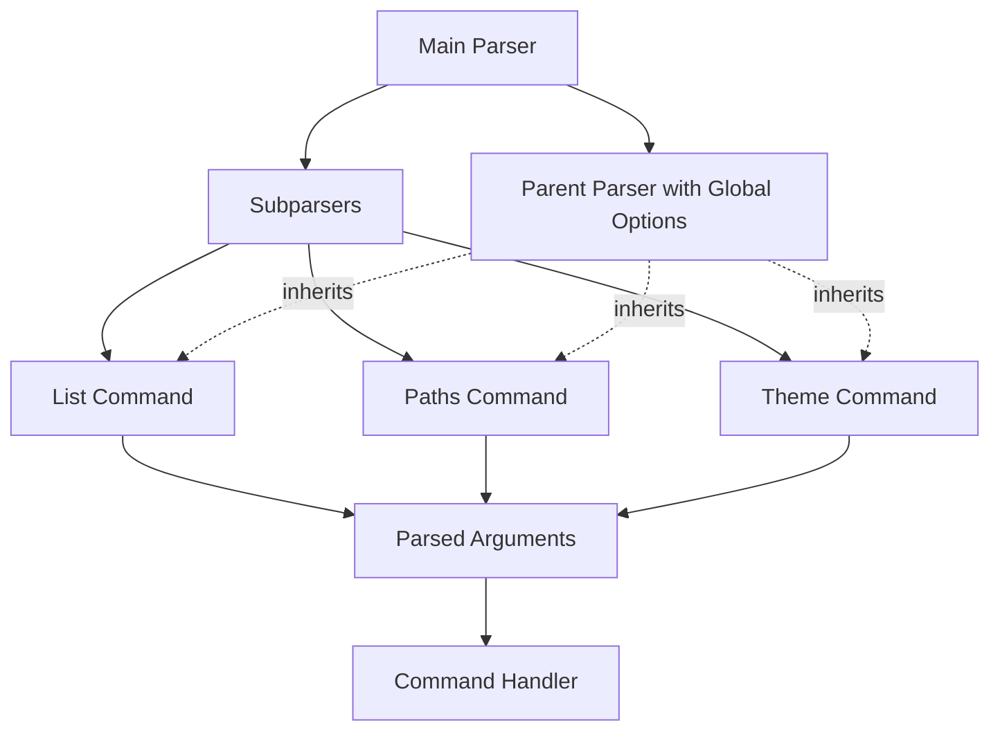
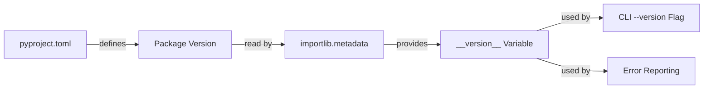

# Architecture

This document describes the high-level architecture of the `kde-colors` project.

## Package Structure

The `kde_colors` package is organized into the following structure:

```text
kde_colors/
├── __init__.py        # Main package initialization
├── __main__.py        # Entry point for direct execution, defined in pyproject.toml, calls cli_runner.run_cli()
├── cli/               # Command-line interface components
│   ├── __init__.py
│   ├── cli_arg_parser.py  # Argument parsing
│   └── cli_runner.py      # Command execution
├── interfaces/        # Protocol definitions
│   ├── __init__.py
│   ├── file_system.py     # FileSystem interface
│   ├── output_formatter.py # OutputFormatter interface
│   └── theme_loader.py    # ThemeLoader interface
├── services/          # Service implementations
│   ├── __init__.py
│   ├── environment.py     # Environment service
│   ├── file_system.py     # Read-only FileSystem implementation
│   ├── output_formatter.py # OutputFormatter implementation
│   └── theme_loader.py    # ThemeLoader implementation
└── tests/             # Test suite
    ├── __init__.py
    ├── unit/               # Unit tests
    │   └── __init__.py
    ├── integration/          # Integration tests
    │   └── __init__.py
    └── e2e/             # End-to-end tests
    │   └── __init__.py
    ├── interfaces/        # Interface test doubles
    │   ├── __init__.py
    │   ├── environment_test_interface.py
    │   └── file_system_double.py
    ├── fixtures/          # Test fixtures
        └── __init__.py
```

## Project Script

The `kde-colors` script is the entry point for the application. It is defined in the `kde_colors.__main__` module.

pyproject.toml defines the script entry point:
scripts = {'kde_colors' = "kde_colors.__main__:main"}

## System Overview

The following diagram shows the main components of the system and their relationships:

## Interface Design

The system uses protocol-based interfaces to define clear contracts between components. The main interfaces are defined in the `kde_colors.interfaces` package:

### FileSystem Interface

- __Purpose__: Abstract Read-only file system operations injector.
- __Location__: `kde_colors.interfaces.file_system`
- __Key Methods__: `read_file()`, `file_exists()`, `exists()`, `is_file()`, `is_dir()`, `glob()`, `walk()`, `resolve_path()`, `expand_path()`, `list_files()`, `list_dir()`

#### tests/interfaces/file_system_double.py

- __Inherits__: Inherits from  `kde_colors.interfaces.file_system`
- __Purpose__: Mock implementation of the FileSystem injector interface for testing.  Adds write operations.
- __Location__: `kde_colors.tests.interfaces.file_system_double`
- __Key Methods__: `write_file()`, `mkdir`, `delete_file()`, `rmdir()`

### XDG Interface

- __Purpose__: Abstract XDG Base Directory Specification injector that encapsulates xdg-base-dirs.  Allows tests to inject custom XDG directories (in-memory or temporary directories).
- __Location__: `kde_colors.interfaces.xdg`
- __Key Methods__: `xdg_cache_home()`, `xdg_config_dirs()`, `xdg_config_home()`, `xdg_data_dirs()`, `xdg_data_home()`, `xdg_runtime_dir()`, `xdg_state_home()`

### ThemeLoader Interface

- __Purpose__: Load and query KDE themes using XDG and FileSystem Interfaces.
- __Location__: `kde_colors.interfaces.theme_loader`
- __Key Methods__: `load_themes()`

### OutputFormatter Interface

- __Purpose__: Format theme data into different output formats
- __Location__: `kde_colors.interfaces.output_formatter`
- __Key Method__: `format()`

### Environment Interface

- __Purpose__: Abstract environment detection injector that encapsulates environment variables.  Allows tests to inject custom environment variables.
- __Location__: `kde_colors.interfaces.environment`
- __Key Methods__: `getenv()`

### Environment Test Interface

- __Purpose__: Abstract environment detection injector that encapsulates environment variables.  Allows tests to inject custom environment variables.
- __Location__: `kde_colors.tests.interfaces.environment_test_interface`
- __Key Methods__: `getenv()`, `setenv()`, `unsetenv()`

### Services

- __Purpose__: Implement protocol interfaces.
- __Location__: `kde_colors.services`
- __Key Classes__: `ThemeLoader`, `FileSystem`, `OutputFormatter`, `EnvironmentService`

### ThemeLoader Service

- __Purpose__: Load and query KDE themes using XDG and FileSystem Interfaces.
- __Location__: `kde_colors.services.theme_loader`
- __Key Methods__: `load_themes()`

### FileSystem Service

- __Purpose__: Abstract Read-only file system operations injector.
- __Location__: `kde_colors.services.file_system`
- __Key Methods__: `read_file()`, `file_exists()`, `exists()`, `is_file()`, `is_dir()`, `glob()`, `walk()`, `resolve_path()`, `expand_path()`, `list_files()`, `list_dir()`

### OutputFormatter Service

- __Purpose__: Format theme data into different output formats
- __Location__: `kde_colors.services.output_formatter`
- __Key Method__: `format()`

### Environment Service

- __Purpose__: Abstract environment detection injector that encapsulates environment variables.  Allows tests to inject custom environment variables.
- __Location__: `kde_colors.services.environment`
- __Key Methods__: `getenv()`

## Data Classes

### Theme Class

- __Purpose__: Represents a KDE theme.
- __Location__: `kde_colors.theme`
- __Key Attributes__: `name`, `id`, `package`, `normalized_name`, `colors`
- __Key Methods__: `__str__()`, `to_json()`, `load()`

## CLI Package Architecture

The `kde_colors.cli` package handles all command-line interaction and serves as the entry point for the application.

### cli_arg_parser.py

- __Purpose__: Defines and handles command-line argument parsing
- __Key Components__:
  - `create_parser()`: Creates and configures the command-line argument parser
  - `parse_args()`: Parses command-line arguments and applies defaults
  - `get_version()`: Retrieves the application version

### cli_runner.py

- __Purpose__: Executes CLI commands based on parsed arguments
- __Key Components__:
  - `CLIRunner` class: Orchestrates the execution of commands
  - Command handlers: `_cmd_list()`, `_cmd_paths()`, `_cmd_theme()`
  - `run_cli()`: Entry point function for the application

### Command-line Argument Parsing

The CLI argument parsing architecture uses the sub-parser pattern from Python's `argparse` module:



This architecture has several benefits:

1. __Consistent Option Handling__: Global options like `--verbose` are defined once but work universally
2. __Modular Design__: Each command is encapsulated in its own parser
3. __Extensible__: Adding new commands requires minimal changes to existing code
4. __Uniform Help Text__: Help documentation is standardized across all commands

### Version Management

Version information is managed through Python's standard library:



This approach follows Python's best practices:

1. The version is defined exactly once in the project metadata
2. Runtime version detection uses the standard library's `importlib.metadata`
3. No hardcoded version strings throughout the codebase

## Components

### CLI

The Command Line Interface (CLI) is the main entry point for users. It handles:

- Command-line argument parsing
- User input validation
- Coordinating between different components

### Core Services

#### ThemeLoader

The ThemeLoader component is responsible for:

- Loading theme data from KDE configuration files
- Validating theme data
- Providing a clean interface for accessing theme properties

#### FileSystem

The FileSystem component handles all file system operations:

- Enables test doubling by routing file system operations to a protocol interface
- Provides a clean interface for accessing file system properties
- Handles file system errors

### Output Formatters

Output formatters convert theme data into different formats:

- JSON
- Human-readable text
- Potentially other formats in the future
